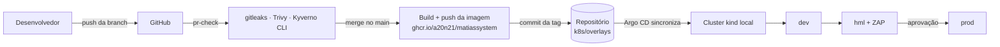
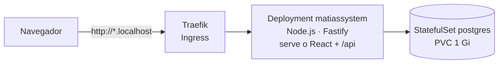
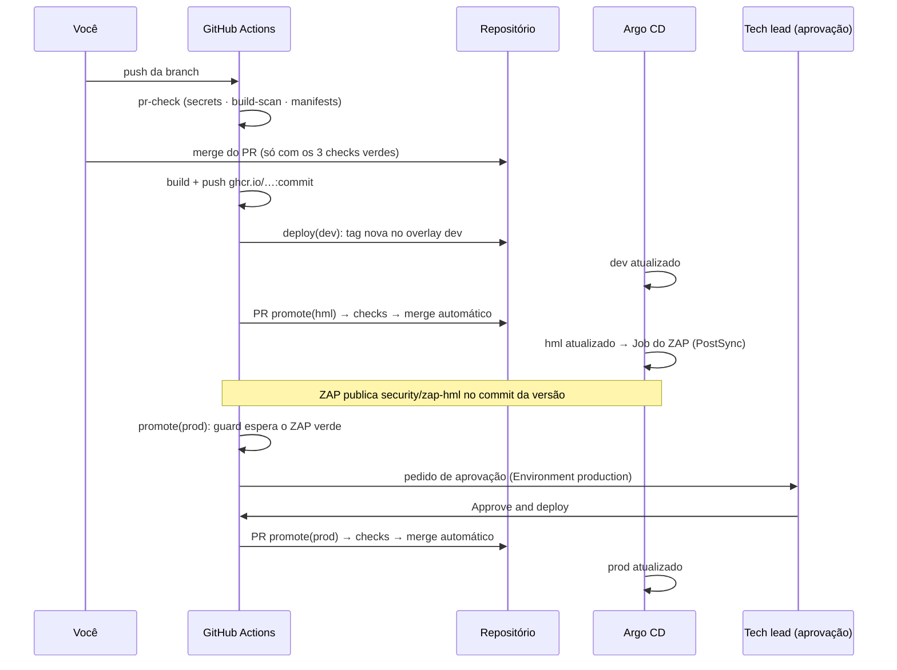

# MatiasSystem

Portal pessoal de estudos que também é um **laboratório de DevOps**: o app roda num Kubernetes
local (kind), é publicado por **GitOps** com Argo CD e passa por **seis camadas de segurança**
entre o commit e a produção.

- **O app:** trilhas de estudo, cursos com checklist de aulas assistidas, anotações em Markdown,
  cronômetro de sessões de estudo, roadmap e backup, tudo atrás de login.
- **A plataforma:** cluster kind, Argo CD (app of apps), Traefik, metrics-server, Kyverno,
  PostgreSQL por ambiente, esteira GitHub Actions com promoção dev → hml → prod e aprovação humana.

---

## Sumário

1. [Visão geral](#1-visão-geral)
2. [Funcionalidades do app](#2-funcionalidades-do-app)
3. [Arquitetura](#3-arquitetura)
4. [Tecnologias e versões](#4-tecnologias-e-versões)
5. [Estrutura do repositório](#5-estrutura-do-repositório)
6. [Pré-requisitos](#6-pré-requisitos)
7. [Subir o ambiente do zero](#7-subir-o-ambiente-do-zero)
8. [Desenvolvimento local](#8-desenvolvimento-local)
9. [Ambientes](#9-ambientes)
10. [Esteira de entrega (CI/CD + GitOps)](#10-esteira-de-entrega-cicd--gitops)
11. [Segurança](#11-segurança)
12. [Senhas, segredos e dados](#12-senhas-segredos-e-dados)
13. [Operação do dia a dia](#13-operação-do-dia-a-dia)
14. [Solução de problemas](#14-solução-de-problemas)
15. [Decisões de projeto](#15-decisões-de-projeto)
16. [Roadmap](#16-roadmap)

---

## 1. Visão geral



Tudo que roda no cluster está descrito no Git. Ninguém aplica mudanças à mão: o **Argo CD**
lê o repositório e deixa o cluster igual ao que está no `main`.

---

## 2. Funcionalidades do app

| Tela | O que faz |
|---|---|
| **Login** | Usuário e senha únicos. Bloqueia após 5 tentativas por minuto. |
| **Início** | Estudando agora, concluídos, planejados, tempo estudado (hoje, semana, total, gráfico de 7 dias), progresso por trilha, roadmap em andamento. |
| **Meus estudos** | Lista com busca (título, anotações e tags), filtros por trilha e status. |
| **Estudo** | Status, progresso, **checklist de aulas**, **cronômetro**, histórico de sessões e **anotações em Markdown** com pré-visualização (Ctrl+S salva). |
| **Trilhas** | Áreas de estudo (AWS, Kubernetes...) com cor, progresso e a lista de estudos de cada uma. |
| **Roadmap** | Quadro com as colunas Próximo, Em andamento e Feito. |
| **Configurações** | Exportar e importar backup completo em JSON. |

### Modelo de dados

```
Trilha (ex.: AWS)
 └─ Estudo (ex.: Preparação para o SAA-C03)        progresso = % de aulas assistidas
     ├─ Aulas (checklist)                          ☑ Aula 1  ☑ Aula 2  ☐ Aula 3
     ├─ Sessões de estudo (cronômetro)             25min · 1h 10min · ...
     └─ Anotações (Markdown)
```

**Regras automáticas:**

- Com aulas cadastradas, **progresso e status do estudo são calculados**: nenhuma aula marcada
  mantém o status, alguma marcada vira *Estudando*, todas marcadas vira *Concluído* (com data).
- O **progresso da trilha** é a média do progresso dos seus estudos.
- O **cronômetro** é único: iniciar outra atividade encerra a anterior. Ele fica gravado no
  banco, então continua contando se o navegador for fechado.
- "Hoje" e "semana" usam o fuso `America/Sao_Paulo` (configurável por `APP_TIMEZONE`).

---

## 3. Arquitetura

### Aplicação



- **Uma única imagem** serve o frontend compilado (React) e a API (`/api/*`). Rotas
  desconhecidas fora de `/api` devolvem o `index.html` (SPA).
- **Migrações SQL** (`app/server/migrations`) rodam na subida do app, em ordem e uma única vez,
  protegidas por *advisory lock* do Postgres (várias réplicas podem subir juntas).
- **Probes:** `startupProbe` (espera banco e migrações), `readinessProbe` em `/readyz`
  (só recebe tráfego com o banco respondendo) e `livenessProbe` em `/healthz`.

### Plataforma (app of apps)

```
root  (k8s/argocd/root.yaml, único manifesto aplicado à mão)
 ├── traefik            Ingress controller (portas 80/443 do Windows)
 ├── metrics-server     métricas de CPU/memória (HPA, kubectl top, Freelens)
 ├── kyverno            motor de políticas
 ├── policies           políticas do Kyverno (k8s/platform/policies)
 ├── matiassystem-dev   k8s/overlays/dev   (sync automático)
 ├── matiassystem-hml   k8s/overlays/hml   (sync automático + Job do ZAP)
 └── matiassystem-prod  k8s/overlays/prod  (sync automático, após PR aprovado)
```

A ordem de instalação é garantida por *sync waves*: Kyverno (−2) → políticas e plataforma (−1) → aplicações.

---

## 4. Tecnologias e versões

| Camada | Tecnologia | Versão |
|---|---|---|
| Cluster | kind (Kubernetes in Docker) | nós `kindest/node:v1.34.0` |
| GitOps | Argo CD (chart `argo-cd`) | 10.9.2 (app v3.5.3) |
| Ingress | Traefik | chart 41.6.0 (v3.7.13) |
| Métricas | metrics-server | chart 3.14.0 (v0.9.0) |
| Políticas | Kyverno (`ValidatingPolicy`, CEL) | chart 3.9.1 (v1.19.1) |
| Banco | PostgreSQL | 17.11-alpine |
| Backend | Node.js · Fastify · TypeScript · Zod · pg | 24.21 · 5 · 7 · 4 · 8 |
| Frontend | React · Vite · React Router · TanStack Query | 19 · 8 · 7 · 5 |
| CI | GitHub Actions | — |
| Registry | GitHub Container Registry (GHCR), pacote público | — |
| Segurança | Trivy · gitleaks · Kyverno CLI · OWASP ZAP | 0.36.0 (action) · 3.0.0 · 1.19.1 · 2.16.1 |

Actions de terceiros são fixadas por **hash do commit**, não por tag.

---

## 5. Estrutura do repositório

```
.
├── app/
│   ├── Dockerfile              multistage: build do front, build do back, runtime Node
│   ├── web/                    frontend React (Vite)
│   │   └── src/                pages/, components/, api.ts, styles.css
│   └── server/                 API Fastify
│       ├── src/                routes/, auth.ts, security.ts, db.ts, password.ts
│       └── migrations/         001_esquema.sql ... 005_sessoes_de_estudo.sql
├── k8s/
│   ├── base/                   Deployment, Service, Ingress, Postgres (comum aos ambientes)
│   ├── overlays/               dev, hml (+ Job do ZAP), prod (+ HPA)
│   ├── argocd/                 root.yaml (app of apps) e apps/
│   └── platform/               values dos charts, políticas do Kyverno e testes delas
├── .github/workflows/
│   ├── pr-check.yaml           validações de toda branch
│   ├── build-and-deploy-dev.yaml
│   └── promote.yaml            dev → hml → (aprovação) → prod
├── scripts/criar-segredos.ps1  senhas por ambiente (fora do Git)
├── bootstrap.ps1               recria o ambiente do zero
├── docker-compose.yml          desenvolvimento local com recarga automática
├── kind-cluster.yaml           configuração do cluster
├── .trivyignore.yaml           exceções do Trivy (com justificativa)
└── .gitattributes              scripts sempre com quebra de linha LF
```

---

## 6. Pré-requisitos

- Windows com **Docker Desktop** (WSL 2)
- **kind**, **kubectl** e **Helm**: `winget install Kubernetes.kind Helm.Helm` (o kubectl vem com o Docker Desktop)
- **Git**
- Opcional: **Freelens**, para visualizar o cluster

Não é preciso ter Node.js instalado: builds e desenvolvimento rodam em containers.

> **cgroup v1:** o Kubernetes 1.35+ exige cgroup v2. Enquanto o WSL estiver em cgroup v1,
> os nós do kind ficam fixados na v1.34 (`kind-cluster.yaml`).

---

## 7. Subir o ambiente do zero

```powershell
.\bootstrap.ps1
```

O script, na ordem:

1. Cria o cluster kind (`kind-cluster.yaml`)
2. Instala o Argo CD via Helm (o único componente fora do Git)
3. Gera uma **deploy key** para o Argo CD ler o repositório e pede que você a cadastre no GitHub
4. Pede o **token do GHCR** (`read:packages`) e cria o `ghcr-pull` nos namespaces
5. Roda `scripts/criar-segredos.ps1`: senha do banco (aleatória) e sua senha de login, por ambiente
6. Pede o **token do ZAP** (fine-grained, *Commit statuses: Read and write*)
7. Aplica o `root.yaml`: a partir daqui o Argo CD instala todo o resto

Ao final, acesse http://argocd.localhost (usuário `admin`; o script mostra a senha).

---

## 8. Desenvolvimento local

```powershell
git checkout main
git pull
git checkout -b feat/minha-mudanca
docker compose up -d
```

Abra **http://localhost:8081**: usuário `matias`, senha `matias123` (válidos só no compose).

| Serviço | O que roda |
|---|---|
| `db` | Postgres 17 (dados no volume `pgdata`) |
| `server` | API com recarga automática (nodemon + tsx) |
| `web` | Vite dev server com recarga instantânea, repassando `/api` para a API |

- Mudou `app/web/src`: aparece no navegador sem F5.
- Mudou `app/server/src` ou `migrations/`: a API reinicia sozinha.
- **Migração nova:** crie `app/server/migrations/006_descricao.sql`. Nunca altere uma migração
  que já foi aplicada em algum ambiente.

| Comando | Para quê |
|---|---|
| `docker compose ps` | Ver se está rodando |
| `docker compose logs -f server` | Acompanhar a API |
| `docker compose down` | Parar (mantém os dados) |
| `docker compose down -v` | Parar e **apagar** os dados locais |

---

## 9. Ambientes

| Ambiente | Endereço | Réplicas | Atualização |
|---|---|---|---|
| Local | http://localhost:8081 | 1 | A cada arquivo salvo |
| dev | http://dev.matiassystem.localhost | 1 | Automática a cada merge no `main` |
| hml | http://hml.matiassystem.localhost | 2 | Automática depois do dev, com ZAP |
| prod | http://matiassystem.localhost | 3 a 10 (HPA) | Depois do hml, **com aprovação** |
| Argo CD | http://argocd.localhost | — | — |

Cada ambiente tem **namespace, banco, senha de login e dados próprios**. A mesma imagem
(mesmo hash de commit) passa pelos três: o que foi testado na hml é exatamente o que vai para o prod.

---

## 10. Esteira de entrega (CI/CD + GitOps)



| Workflow | Quando roda | O que faz |
|---|---|---|
| `pr-check` | Push em qualquer branch que não seja o `main` | gitleaks; build + Trivy da imagem; Kustomize + Trivy IaC + Kyverno CLI |
| `build-and-deploy-dev` | Merge no `main` que mexa em `app/` | Publica a imagem, atualiza o overlay de dev e dispara `promote(hml)` |
| `promote` | Disparado pela etapa anterior (ou à mão) | Copia a versão do ambiente anterior, abre PR, espera os checks e faz merge |

**Proteções:**

- O `main` exige PR com os 3 checks verdes; só a *deploy key* do CI tem bypass (para publicar a tag do dev).
- O `promote(prod)` **não pede aprovação** se houver promoção de hml pendente ou se o ZAP não aprovou a versão.
- **Rollback:** `git revert` do PR de promoção. O Argo CD volta a versão anterior sozinho.

**Tempo típico entre o merge e o prod:** 10 a 15 minutos (o Argo CD consulta o Git a cada ~3 min e o ZAP leva ~4 min).

---

## 11. Segurança

### Camadas

| # | Camada | Ferramenta | Onde | Bloqueia |
|---|---|---|---|---|
| 1 | Segredos no código | gitleaks | `pr-check` | Merge |
| 2 | CVEs da imagem | Trivy (HIGH/CRITICAL com correção) | `pr-check` | Merge |
| 3 | Configuração dos manifestos | Trivy IaC | `pr-check` | Merge |
| 4 | Políticas do cluster (offline) | Kyverno CLI | `pr-check` | Merge |
| 5 | Políticas do cluster (admissão) | Kyverno | Cluster | Criação do pod |
| 6 | Ataque à aplicação rodando (DAST) | OWASP ZAP | Job PostSync na hml | Promoção para prod |
| 7 | Decisão humana | GitHub Environment | Antes do prod | Deploy |

### Políticas do Kyverno (namespaces `matiassystem-*`)

- `pod-hardening`: `runAsNonRoot`, sem escalonamento de privilégio, rootfs somente leitura,
  `capabilities.drop: [ALL]`, limites de CPU e memória.
- `image-rules`: só imagens de `ghcr.io/a20n21/`, `ghcr.io/zaproxy/` e `docker.io/library/postgres:`,
  sempre com tag explícita e nunca `:latest`.

### Aplicação

- Senha guardada como **hash scrypt** (nunca em texto). Login com tempo constante e **rate limit**.
- Sessão em cookie `httpOnly` + `SameSite=Strict`. No banco fica só o SHA-256 do token.
- API aceita só JSON (sem `text/plain`) e recusa escrita vinda de outra origem.
- Headers: CSP restritiva (sem inline), `X-Frame-Options`, `nosniff`, `Permissions-Policy`,
  `Cross-Origin-*`, `Referrer-Policy`. `Cache-Control: no-store` na API.
- Markdown renderizado sem HTML cru (sem XSS pelas anotações).

### Containers

- App e Postgres rodam como **UID 10101**, rootfs somente leitura, sem capabilities, seccomp `RuntimeDefault`.
- A imagem do app **não tem npm/yarn/corepack** e aplica `apk upgrade` no build.
- Token da service account desligado (`automountServiceAccountToken: false`).

### Exceções (sempre com justificativa)

- `.trivyignore.yaml`: registry do GHCR "não confiável" (é o nosso) e UID 1000 do ZAP, só na hml.
- `k8s/overlays/hml/zap/rules.tsv`: conteúdo cacheável e "ZAP desatualizado" ignorados.

### Rede

As portas 80, 443 e 8081 escutam em todas as interfaces (`0.0.0.0`), então outros dispositivos
da mesma rede conseguem acessá-las. O app exige login, mas **em redes públicas pare o ambiente**
(`docker compose down` e feche o Docker Desktop).

---

## 12. Senhas, segredos e dados

Nenhuma senha está no Git. Por ambiente:

| Secret | Conteúdo | Criado por |
|---|---|---|
| `matiassystem-db` | Usuário, banco e senha do Postgres (aleatória, 32 caracteres) | `criar-segredos.ps1`, **uma única vez** |
| `matiassystem-app` | Usuário `matias` e hash da sua senha de login | `criar-segredos.ps1` |
| `ghcr-pull` | Token de leitura do GHCR | `bootstrap.ps1` |
| `zap-github-status` (hml) | Token que publica o resultado do ZAP | `bootstrap.ps1` |
| `repo-matiassystem` (argocd) | Deploy key de leitura do repositório | `bootstrap.ps1` |

```powershell
.\scripts\criar-segredos.ps1                   # dev, hml e prod
.\scripts\criar-segredos.ps1 -Ambientes prod   # trocar a senha de login do prod
.\scripts\criar-segredos.ps1 -SomenteBanco     # só cria o que faltar do banco
```

> A senha do Postgres **nunca** é sobrescrita: ele só a lê na primeira inicialização do banco.
> Trocá-la depois faria o app perder o acesso.

### Backup

O banco fica num volume do cluster local: **apagar o cluster apaga os dados**.
Em **Configurações → Exportar backup** o app baixa um JSON com trilhas, estudos, aulas,
sessões e roadmap. **Importar** substitui todos os dados do ambiente, numa única transação.

---

## 13. Operação do dia a dia

| Tarefa | Comando |
|---|---|
| Estado das aplicações | `kubectl -n argocd get applications` |
| Pods de um ambiente | `kubectl -n matiassystem-prod get pods` |
| Logs da API | `kubectl -n matiassystem-prod logs deploy/matiassystem` |
| Logs do banco | `kubectl -n matiassystem-prod logs statefulset/postgres` |
| Resultado do último ZAP | `kubectl -n matiassystem-hml logs job/zap-baseline` |
| Consumo de CPU/memória | `kubectl top pods -n matiassystem-prod` |
| Autoscaling do prod | `kubectl -n matiassystem-prod get hpa` |
| Senha do Argo CD | `kubectl -n argocd get secret argocd-initial-admin-secret -o jsonpath="{.data.password}"` (em base64) |
| Promover manualmente | GitHub → Actions → **promote** → Run workflow |

Antes de qualquer comando que altere algo, confira o cluster ativo:
`kubectl config current-context` deve mostrar `kind-matiassystem`.

---

## 14. Solução de problemas

| Sintoma | Causa provável | O que fazer |
|---|---|---|
| Argo CD mostra *Degraded* no prod logo após um deploy | O HPA ainda não tem métricas dos pods novos | Aguarde 1 a 2 minutos |
| Pod do app em `CreateContainerConfigError` | Faltam os Secrets do ambiente | `.\scripts\criar-segredos.ps1` |
| Pod do app reiniciando na subida | Banco ainda subindo (o app espera até ~2 min) | Veja `logs statefulset/postgres` |
| Login recusado com a senha certa | Hash gerado com caractere invisível (BOM) | Recrie com `criar-segredos.ps1 -Ambientes <amb>` |
| `promote(prod)` falha em "Exigir ZAP verde" | ZAP reprovou, ou não publicou (token ausente/sem permissão) | Veja os logs do Job do ZAP; o `AVISO` indica a causa |
| Job do ZAP: `not found` / `Bad fd number` | Script com quebra de linha do Windows (CRLF) | O `.gitattributes` evita; confirme que o arquivo está em LF |
| Check `build-scan` vermelho | CVE nova com correção disponível | Atualize a imagem base ou o pacote; rode o Trivy localmente |
| Argo CD fica *OutOfSync* sem motivo aparente | Diferença de normalização (ex.: mapas vazios) | Veja a diferença exata na API do Argo CD (`managed-resources`) |
| `kubectl` fala com outro cluster | Contexto errado (ex.: um AKS no WSL) | `kubectl config use-context kind-matiassystem` |

---

## 15. Decisões de projeto

- **Ambientes como pastas (overlays), não como branches.** Promover é trocar uma tag num PR:
  sem merges entre branches divergentes, e a mesma imagem passa por todos os ambientes.
- **GitHub Flow**: só o `main` e branches curtas. Nada de `develop`.
- **App of apps**: a plataforma inteira é recriável a partir do Git.
- **Encadeamento por `workflow_dispatch`**: ações feitas com `GITHUB_TOKEN` não disparam outros
  workflows; `workflow_dispatch` é a exceção.
- **`pr-check` em push de branch**: em repositório público, PRs abertos pelo bot exigiriam aprovação manual para rodar.
- **ZAP dentro do cluster**: os runners do GitHub não enxergam o cluster local. O resultado volta
  ao GitHub como *commit status*, usado como gate da promoção para prod.
- **Uma imagem para front e back**: menos peças; o Fastify serve os arquivos do React.
- **Progresso calculado pelas aulas**: menos coisa para manter à mão e sem números inconsistentes.

---

## 16. Roadmap

- [ ] Observabilidade: Prometheus e Grafana (gráficos no Freelens)
- [ ] Portas do cluster e do compose restritas a `127.0.0.1`
- [ ] Sealed Secrets: segredos versionados no Git, criptografados
- [ ] Backup automático do banco (CronJob com `pg_dump`)
- [ ] Argo CD com sincronização mais rápida (intervalo de 60 s)
- [ ] Renovate/Dependabot para atualizar imagens e dependências por PR
- [ ] Refinamentos do app: arrastar cards no roadmap, tema claro/escuro, metas semanais de tempo
